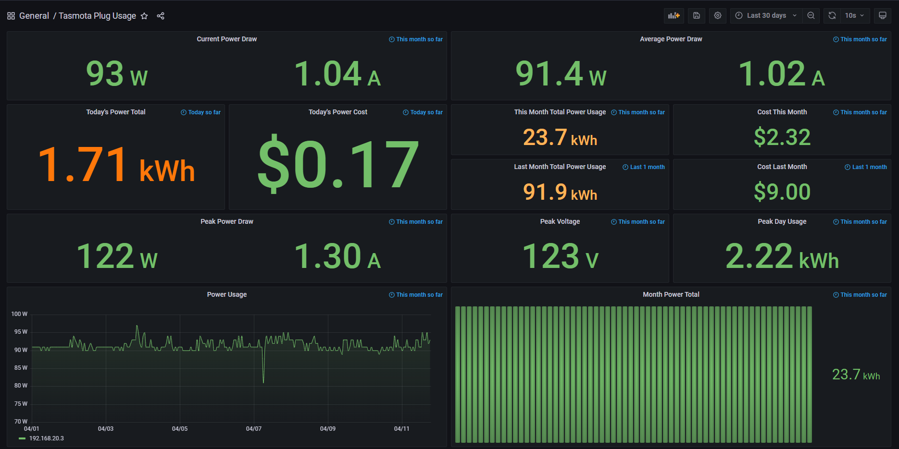

# Tasmota Power Exporter

A custom exporter for Prometheus for the Tasmota open source smart plug firmware.

Allows you to collect metrics directly from individual smart plugs without the use of HomeAssistant or something similar.

## Grafana Dashboard

Available in [grafana.json](./grafana.json)



## Deployment

The GitHub actions pipeline automatically builds Docker images for ARM and x86 devices for simplified deployment.

Docker-Compose:
```
  tasmota:
    image: ghcr.io/astr0n8t/tasmota-power-exporter:latest
    container_name: tasmota-power
    restart: always
    ports:
    - 8000:8000
    environment:
    - DEVICE_IP=<Tasmota IP>
    - USER=<user>
    - PASSWORD=<password>
```

Prometheus Config:
```
- job_name: "tasmota"

    # metrics_path defaults to '/metrics'
    # scheme defaults to 'http'.

    static_configs:
        - targets: ["127.0.0.1:8000"]
```

## Development

Perform the following:

```
git clone https://github.com/astr0n8t/tasmota-power-exporter.git
cd tasmota-power-exporter
pip install -r requirements.txt
```

All of the exporter code is found in [metrics.py](./metrics.py).

## Contributors

- [Nathan Higley](https://github.com/astr0n8t)